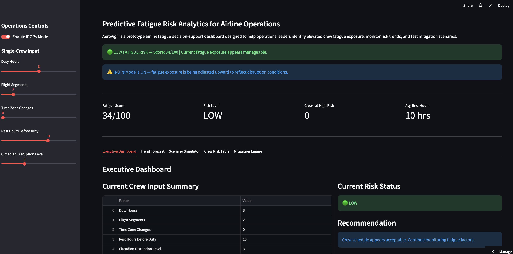

# AeroVigil

**Predictive Fatigue Risk Analytics for Aviation Safety**

---

## AeroVigil Dashboard Preview

AeroVigil is an aviation fatigue risk analytics platform designed to support airline operations with predictive insights, crew risk monitoring, and decision-support tools.

### Key Features
- Real-time fatigue risk scoring
- 7-day fatigue trend forecasting
- Scenario simulation for schedule optimization
- Multi-crew risk monitoring dashboard
- IROPs (disruption) mode



---

## Live Demo

👉 https://aerovigil-demo.streamlit.app

---

## Overview

Fatigue remains one of the most critical human factors challenges in aviation safety. AeroVigil explores how operational inputs from crew scheduling and duty periods can be transformed into a clear, interpretable **fatigue risk score**.

This prototype demonstrates how predictive analytics can support airline operations by identifying fatigue risk **before flights operate**, enabling proactive safety decisions.

---

## Core Features

- Fatigue risk scoring (0–100 scale)
- Risk classification:
  - LOW
  - MODERATE
  - HIGH
- Real-time mitigation recommendations
- 7-day fatigue trend forecasting
- Scenario simulation for schedule adjustments
- Multi-crew risk table using CSV data
- IROPs (Irregular Operations) fatigue modeling
- Interactive dashboard built with Streamlit

---

## How It Works

The fatigue model evaluates key operational inputs:

- Duty hours  
- Flight segments  
- Time zone changes  
- Rest hours before duty  
- Circadian disruption  

Each factor contributes to a weighted fatigue score, which is normalized to a **0–100 risk scale**.

### Workflow

Operational Inputs  
↓  
Fatigue Risk Algorithm  
↓  
Fatigue Score (0–100)  
↓  
Risk Classification  
↓  
Mitigation Guidance  
↓  
Dashboard Visualization  

---

## Example Use Cases

AeroVigil can support:

- Crew scheduling scenario comparisons  
- Fatigue risk visualization for safety teams  
- Human factors research demonstrations  
- Early-stage aviation safety analytics development  
- Concept validation for predictive safety tools  

---

## Future Development Roadmap

- Integration with real airline scheduling data  
- Predictive fatigue alert system  
- AI-driven fatigue forecasting models  
- FRMS (Fatigue Risk Management System) alignment  
- Safety Management System (SMS) integration  
- Multi-day crew scheduling optimization  
- Exportable fatigue risk reports  
- Real-time operational dashboards for airlines  

---

## Tech Stack

- Python  
- Streamlit  
- Pandas  
- Matplotlib  

---

## Project Structure

```bash
AeroVigil/
│
├── app.py
├── fatigue_calculator.py
├── crew_data.csv
├── requirements.txt
├── README.md
└── aerovigil_v3.png
```
---

## Vision

AeroVigil represents an early-stage concept for predictive aviation safety analytics.

The long-term goal is to help aviation organizations transition from reactive fatigue management to proactive, data-driven risk prediction, supporting both operational decision-making and safety systems such as SMS and FRMS.

---

## Author

**Bosslady Fifita**  
Founder — AeroVigil  

MS Aeronautics  

Focus Areas:
- Aviation Human Factors  
- Fatigue Risk Management  
- Aviation Safety Systems  
- Predictive Safety Analytics  

---

## Disclaimer

AeroVigil is a prototype created for educational, research, and demonstration purposes only.

It is not intended to replace certified aviation fatigue management systems, regulatory compliance tools, or operational decision-making systems used by airlines or aviation authorities.

---

## License

This project is licensed under the MIT License.  
See the `LICENSE` file for details.
